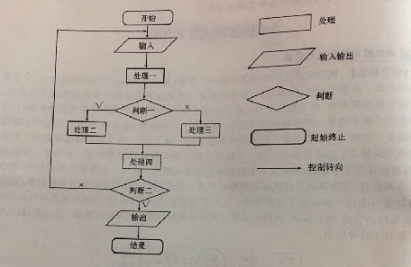
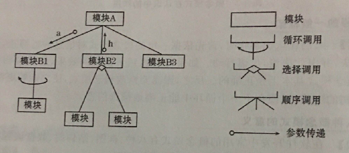
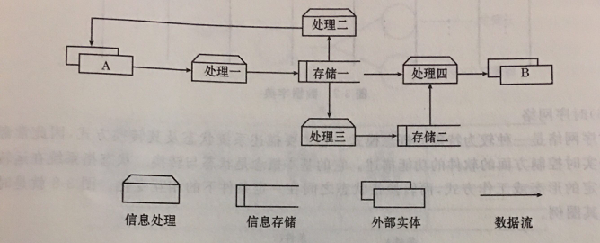
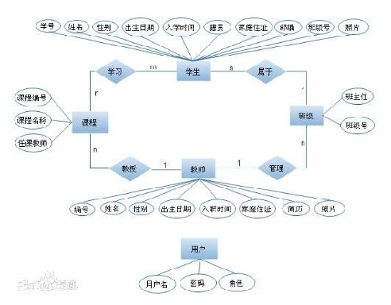
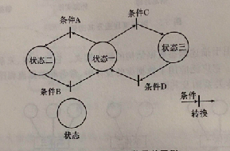
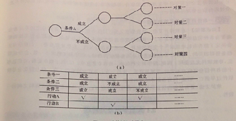
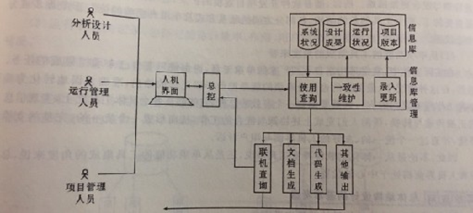
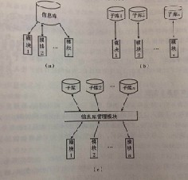

# 1、绪论

## 1.1 软件开发工具的由来

### 1.1.1 软件开发工具定义

> 软件开发工具就是帮助人们开发软件的工具

软件开发工具的范围大致可以描述为：**在高级程序设计语言（`第三代语言`）的基础上,为提高软件开发的质量和效率，从规划、分析、设计、测试、文档和管理等各方面，对软件开发者提供各种不同程度的帮助的一类新型软件**

### 1.1.2 软件开发工具的发展过程

1. 机器语言阶段

   使用0、1代码进行编程

2. 汇编语言阶段

   使用助记符来编写程序,由汇编系统将汇编指令转化为机器器指令,编程⼯作量⼤大降低,`但仍未摆脱对硬件的依赖`。与此同时,`操作系统的出现`从另一方面改善了⼈们应用计算机的条件

3. 高级语言阶段

   20世纪60年代初期，高级语⾔突破了与机器指令⼀一⼀一对应的限制,实现了对机器的独⽴性.从⽽而⼤大提⾼了程序的可移植性

4. 第四代语言阶段

5. 利用通用软件作为辅助工具的阶段

6. 专用软件开发工具阶段

7. 集成的软件开发工具阶段

### 1.1.3 软件开发工具产生及应用的必然性及发展趋势

1. 软件开发工具产生及应用的必然性

   硬件是计算机的躯体，软件是计算机的灵魂

   软件开发工具是软件技术发展到一定阶段的必然产物

2. 软件开发工具的发展趋势

   1. 面向网络

      软件开发应用于互联网，越来越注重网络环境下使用

   2. 开源软件的兴起和运用

## 1.2 软件开发的概念

### 1.2.1 软件与软件开发工作的实质

> 算法+文档+程序

软件用来特指看不见、摸不着的,但又发挥着十分重要的作用的,事先编好的指令系列。从应用的角度来看,软件一端连着计算机硬件,向硬件提供可执行的机器指令,另一端面向用户,接受用户提出的要求和算法。软件的实质在于对应用环境和业务流程的正确理解和描述,而不是简单地编程

> 软件 ——> 计算机指令序列

### 1.2.2 软件开发工具的发展主要表现在以下四个方面

1. 自动化程度的提高 ——> 例如 第一代语言-第四代语言、通用辅助工具-集成工具
2. 这一阶段的工作明确地把**需求分析**和**架构设计**包括在软件工作的范围之内,从而使软件开发过程进一步向用户方面延伸,离用户更近了 ——> 通用辅助工具
3. 把软件开发工作延伸到项目及版本管理,从而超出了一次编程的局限,而扩展到了作为一个不断发展的客体生长完善的全过程。 ——> 版本控制工具
4. 在这一阶段的研究中,吸收了许多管理学科的内容与方法,如程序员的组织、质量的控领会软件开发工具的概念、地位及作用。

### 1.2.3 软件开发工具的要点

1. 它是在高级程序设计语言(第三代语言)之后,软件技术进一步发展的产物; 
2. 它的目的是在人们开发软件中给予各种不同方面、不同程度的支持或帮助;
3. 它支持软件开发的全过程,而不是仅限于编码或其他稳定的工作阶段

### 1.2.4 软件开发工具的地位

> 软件开发工具的提出和使用，是软件技术发展的一个新阶段，它是软件发展的必然趋势，是软件技术发展到一定阶段的产物

###  ★ 1.2.5 软件开发工具的作用

> 软件开发工具可以提高软件开发的**效率**，保证软件开发的**质量**，**加快软件开发的周期**，同时使得系统更加**规范**，而且**节省人力财力**

## 1.3 软件开发工具的功能和性能

### 1.3.1 软件开发的过程

1. 初始要求的提出 需求分析 ——> 软件开发工作的起点

2. 总体设计 （结构设计、数据库设计、各部分的连接方式及信息交换的标准等内容）

3. 实现阶段（**程序的编写、文档的编写**）

   软件的概念是程序+文档 

   没有文档的程序是无法推广和使用的

4. 测试和调试阶段（模块测试、系统测试）

### 1.3.2 软件开发工具的五项基本功能

1. 认识与描述客观系统（需求分析阶段）
2. 存储及管理开发过程中的信息 
3. 代码的编写或生成
4. 文档的编制或生成
5. 软件项目管理

### 1.3.3 软件开发工具的主要性能指标

1. 表达能力和描述能力
2. 保持信息一致性的能力
3. 使用的方便程度
4. 工具的可靠程度
5. 对软件和硬件环境的要求（软件开发工具的环境要求应尽量降低，以便广泛使用）

## 1.4 软件开发工具的类别

### 1.4.1 支持不同工作阶段的三种工具

1. 计划工具

   > 计划工具则从更**宏观**的角度去看待软件开发,它不仅从**项目管理**的角度帮助人们组织和实施项目,并且把有关**进度、资源、质量、验收情况**等信息有条不素地管理起来,而且考虑到了项目的反复循环、版本更新,实现了“跨生命周期”的信息管理与共享,为信息以至软件的重用创造了条件

2. 分析工具 ——> 流程图

   > 分析工具主要指用于支持**需求分析**的工具,它虽不直接帮助人们写程序,但它帮助人们认识与表述信息需求与信息流程,从逻辑上明确软件的功能和要求;

3. 设计工具 ——> eclipse

   > 设计工具是最具体的、出现最早的,它是指在**实现阶段**对人们提供帮助的工具,它是最直接地帮助人们编写与调试软件的工具

### 1.4.2 单项工具与集成工具的区别

1. 单项工具

   专用的、面对某一工作阶段或某工作任务的工具

2. 集成工具

   集成化的、面对软件开发的全过程工具

### 1.4.3 依赖于机器或软件的工具与独立于机器或软件的工具的区别

> 分析工具与计划工具往往是独立于机器与软件的

> 集成化的软件开发工具常常是依赖于机器和软件的

## 1.5 刷题知识点

1. 出现得最早、数量最多的软件开发工具类型是 <u>**设计工具**</u>
2. 软件开发工具定义的范畴 <u>**程序生成工具、文档生成工具、分析设计辅助工具**</u>
3. 软件开发工具的优劣取决于 <u>**功能**</u>
4. 更宏观的角度去看待软件开发的是 <u>**计划工具**</u>
5. 从 <u>**第三代**</u> 语言开始，软件摆脱了对硬件的依赖
6. 集成化工具往往<u>**依赖于机器和软件**</u>

# 2、软件开发过程及其组织

## 2.1 软件开发的困难

### 2.1.1 软件开发中的两个转换过程

> 1. `用户对软件功能`的理解与`程序员对软件功能`的理解之间的转换
> 2. `程序员的理解`与`程序的实现`之间的转换

### 2.1.2 大型软件开发中的困难

1. 一致性的保持（十分困难）
2. 测试的问题（大大增加）
3. 工作进度难以控制
4. 文档与代码的协调（十分困难）
5. 版本更新带来的问题（和困难）

### 2.1.3 困难产生的原因

1. 大系统的复杂性（根本原因）
2. 多人协同工作的组织管理
3. 领域知识与软件技术之间的差别  （各个领域之间的差别导致困难的加重）
4. 时间因素及变更因素

## 2.2 软件开发方法的发展

### 2.2.1 结构化程序设计的思想方法（C语言）

> 特点：高内聚、低耦合、

> 遵循的原则：自顶向下、逐层分解设计，单一入口和出口；
>
> ​					模块内三种基本语句结构：顺序结构、选择结构和循环结构
>
> ​					限制使用GOTO语句

### 2.2.2 软件工程的基本思想与方法

> 核心：以工程化的方法编写软件

### 2.2.3 面向对象的程序设计的基本思想与方法

1. 客观世界的任何事物都是对象,它们都有⼀些静态属性(相应于数据结构),也都有 些相关的操作(相应于程序模块)。
2. 对象之间有抽象与具体,群体与个体,整体与部分等⼏种关系。 
3. 抽象的、较⼤的对象所具有的性质,包括静态属性和动态操作,⾃然地成为它的⼦类的性质,不必加以说明和规定,这就是所谓的“遗传性” ——> 封装 多态 继承
4. 对象之间可以互送信息。这消息可以是传送⼀个参数,也可以是使这个对象开始某个操作。 ——> 函数 互相调⽤

### 2.2.4 即插即用程序设计的基本思想与方法（框架）

> 即插即用程序设计概念

⼀部分⼈专⻔⽣产软件组件(相当于芯⽚),⽽另⼀部分⼈构造整个 软件的结构(相当于计算机结构),并且把软件组件插⼊这个结构,以便迅速地完成⼤型软件的研制⼯作。

> 即插即用程序设计方法实现的困难

1. 软件部件的标准化的问题
2. 软件部件的提供方式的问题

## 2.3 软件开发过程的管理

### 2.3.1 软件评价的主要方面

1. 正确地实现所要求的功能，准确地给出预定的输出结果
2. 用户界面友好，符合实际用户的使用习惯与知识能力
3. 具有足够的速度（而不是越快越好），能在符合用户要求的时间限度内，给出所要求的处理结果
4. 具有足够的可靠性，能够在各种干扰下保持正常的工作。
5. 程序易读，结构良好，文档齐全，从而保证系统易于修改

### 2.3.2 程序员与项目组的关系

1. 保证严格地在本模块范围内操作,决不使⽤可能⼲扰其他模块的命令或函数。（⾼内聚，低耦合） 
2. 严格按总体设计的要求和理解去传递参数值,决不随意修改其内容或含义。 
3. 在对公⽤的⽂件或数据库进⾏存取时,必须完全地、准确地按统⼀规定的格式去操作,决不能擅⾃改变。 
4. 在使⽤标识符时,应按照统⼀的原则,尽量使⽤易于看出逻辑含义的名称。（⻅名知意 驼峰法） 
5. 严格按照统⼀的要求编写⽂档,在内容、格式、表达⽅式、符号使⽤上遵循项⽬组的统⼀规定。 
6. 尽量保持程序⻛格的⼀致。

### 2.3.3 对软件工作组的评价

1. 有严格的、成⽂的**⼯作规范**和**⽂档标准**,⽽且应当为全体成员所熟知,并且切实得到遵守。 
2. ⼈员之间有严格的分⼯。 
3. 每个项⽬都要事先制定详细的时间表,并且得到严格执⾏。

## 2.4 刷题知识点

1. 结构化程序设计的⽅法主要是为(<u>**程序员**</u>)服务的。
2. 在⼤型软件开发中,与⽤户有关的任务是 <u>**提出需求**</u>
3. 在⼤型软件开发中,与项⽬负责⼈有关的任务是  <u>**分配任务**</u>
4. .对于软件开发来说,项⽬管理的核⼼是  <u>**质量问题**</u>
5. 在⼤型软件开发中,与程序员有关的任务是   <u>**模块调试**</u> 
6. 结构化程序的基本模块 <u>**处理单元、循环机制、二分决策**</u>
7. ⼤型软件开发过程中,（<u>**项目负责人**</u>）起着最为关键的作⽤。
8. .CMM模型⽤于 <u>**衡量项目组的标准**</u>
9. 软件开发过程中，文档包括 <u>**功能说明书、总体设计、各模块的设计任务书、验收报告、用户手册**</u>
10. 总体设计文件包括 <u>**结构图、公用数据结构、模块清单**</u>

# 3、软件开发工具的理论基础

## 3.1 软件开发过程的信息需求

### 3.1.1 软件开发过程中信息流通的模型

> 软件开发过程中信息流通的模型是⽤**需求分析阶段**建⽴的逻辑模型，表达信息的来源、去向、存储及处理的逻辑过程 

软件开发过程中的信息流通状况如图所示

​														p1

### 3.1.2 软件开发过程中涉及的信息类型

1. 有关系统环境、现状及需求的信息（**分析人员**）
2. 有关软件的功能设计与物理设计的各种信息（**分析人员**）
3. 软件成果本身，包括程序和文档（**程序员**）
4. 用户对系统的各种变更要求，以及系统的各种变更的记录（**维护人员**）

### 3.1.3 软件开发过程中要进行的信息管理

1. 许多信息需要长期保存，因为它们并非只用一次，而是需要不断更新，不断被调用
2. 在许多环节上都要进行数据的转换或加工，这包括手工形式向计算机形式的转换，也包括从计算机方式向手工形式的转换，有时也有在计算机内部的不同形式的数据的转换
3. 还有大量的人与人之间的信息交流，如上图p1，分析人员、程序员、用户、维护人员存在着各种交流。

### 3.1.4 软件开发工具的理论及技术基础

1. 认知科学中关于**概念模式的概念与方法**
2. **数据库技术的理论和方法**
3. **编译技术的有关方法**
4. 关于**人机界面的理论与方法**
5. 管理科学中关于**项目管理与版本管理的理论与方法**
6. **系统科学与系统工程中的有关理论与方法**

## 3.2 概念模式及其作用

### 3.2.1 概念模式的意义和作用

> 概念模式是认知科学中的⼀个⽤语,指的是⼈们在认识事物过程中,对于某事物或某⼀系统形成的、 抽象的、⼀般化的框架。 

> 概念模式是⼈们认识客观世界的⼀种⽅法、⼀种⼯具。

### 3.2.2 简单应用八种概念模式的意义

> 八种常用的概念模式

1. **框图（流程图）**

   > 框图是⼈们在编写软件时**最早使⽤**的⼀种概念模式。它是⽤来**描述程序执⾏的逻辑过程** 它把程序的**基本步骤归纳为处理、判断、输⼊输出、起始或终结**等⼏个基本功能,并⽤不同的记号加以表示。⽤箭头表示控制或执⾏的顺序。当软件规模不太⼤时,它⽐较适⽤                                                                                                             

   

2. **结构图**

   > 结构图⽤来表示**⼤型软件的层次结构,即模块结构**。结构图以模块的调⽤关系为线索,从 宏观上使⼈⼀⽬了然地掌握软件的全貌。结构图的基本图例为模块,⽤⾃上⽽下的连线表示 调⽤关系,并注明参数传递的⽅向与内容。**程序的调⽤⽅式有三种:顺序调⽤、选择调⽤、循环调⽤**。它⽤箭头上的附加记号来表明这⼀点。结构图的优点是能够体现层次观点,由粗到细 ⾃顶向下地描述程序。特别是它可以迫使⼈们逐个地详细划分与描述模块,体现**结构化程序设计**的思想。

   

3. **数据流程图**

   > 数据流程图(简称**DFD**)⾯对的是⼀个系统的信息流程,⽤于描述某⼀业务处理系统的**信息来源、存储、处理、去向**的全⾯情况。它的基本思想是把信息流看做⼀个组织或系统运作的线索,⼒图简明扼要地勾画出全局。**数据流程图的基本元素是外部实体、数据处理与数据存储**。与结构图相⽐,它更适⽤于客观描述, 不仅⼴泛应⽤于描述已有系统的状况,⽽且⼴泛应⽤于描述设想中的新系统。

   

4. **实体关系图(E-R图)**

   > 实体关系图是⼀种⽤于描述**静态数据结构**的概念模式。它以实体、关系、属性三个基本概念概括数据的基本结构。它⼴泛应⽤于数据库的设计中,常常和**数据流程图、结构图等互相配合使⽤**。

   

5. **数据字典**

   > 数据字典(简称DD)是⼀种**描述数据内容**的概念模式。它⽤表格的形式列出数据的基本属性以及相互关系,作为⼈们对于数据的认识和了解,它的雏形是编写软件时的变量说明或标识符清单。 
   >
   > **数据字典是指对数据的数据项、数据结构、数据流、数据存储、处理逻辑等进⾏定义和描述，其⽬的是对数据流程图中的各个元素做出详细的说明，使⽤数据字典为简单的建模项⽬。简⽽⾔之，数据字典是描述数据的信息集合，是对系统中使⽤的所有数据元素的定义的集合。**（背）

6. **时序网络**

   > 时序⽹络是⼀种较为特殊的概念模式。它主要描述系统状态及其转换⽅式,因此常常⽤于⼀些实时控制⽅⾯的软件的功能描述。**它的基本概念是状态与转换**。状态指系统在运转中某⼀特定的形态或⼯作⽅式,⽽转换指状态之 间在⼀定条件下的相互变化。

   

7. **数学与逻辑模型**

   > 数学与逻辑模型是⼈们⽐较熟悉的⼀种概念模式。它⽤来**描述客观系统的状态或运动规律**,它的最⼤优点是严格、准确、可计算,但是,正由于它要求严格,所以限制颇多,⼀般只能指 述⽐较单纯、⽐较基础的功能。另外,作为逻辑模型的表达⽅式,决策树和决策表也是经常使用的

   

8. **计算机模拟模型**

   > 计算机模拟模型是⼀种强有⼒的概念模式,它利⽤计算机⼤量、⾼速处理信息的能⼒,在计算机内设置⼀定的环 境(如资源条件等),⼜以程序来实现客观系统中的某些规律或规则,在⼆者基础上,计算机就可以⾼速运⾏,以便⼈ 们观察与预测客观系统的状况。

## 3.3 信息库以及一致性

### 3.3.1 信息库在软件开发中的作用

> 信息库是针对软件开发或信息系统开发中的⼤量信息管理⼯作提出来的。它是软件开 发全过程中各种有⽤信息的集合,并随着项⽬进度不断修改与补充;它是软件开全过程的信息管理总枢组。

### ★3.3.2 一致性的意义及其维护方法

> 在软件开发中一致性的意义

1. 作为统一的软件，各部分之间不可避免地要有各种信息的交流和共享

2. 程序和⽂档是密切相关的,程序经常改动,⽂档必须有相应的改动。 

3. 由于版本更新,对系统中的各种信息还应有历史的、逻辑的联系。 

   维护⽅法:要有⾜够的信息和科学的管理,保证版本的⼀致性和各种语⾔资料之间的⼀致性

## 3.4 人机界面及其管理

### 3.4.1 人机界面设计的原则

1. 用户界面的主要功能是通信
2. 用户界面必须始终一致
3. 用户界面必须使用户随时掌握任务的进展状况
4. 用户界面必须能提供帮助
5. 宁可让程序多干，不可让用户多干

### 3.4.2 目前常用的人机交互方式

1. 键盘操作
2. 屏幕滚动
3. 菜单选择
4. 帮助系统
5. 鼠标操作
6. 色彩应用
7. 数据录入
8. 信息显示

## 3.5 项目管理与版本管理

### 3.5.1 项目管理的含义与基本目标

项目管理的含义：项⽬管理是指与固定的⽣产线上的⽇常⽣产管理不同的,具有更⼤的变动性、时间性的另⼀类管理任务。

> 项目管理的基本目标

1. 使产品的质量得到有效地控制
2. 保证整个系统按预定的进度完成
3. 有效地利用各种资源，尽可能不会有资源的闲置与浪费的减少
4. 控制与降低成本

> 版本管理的意义：版本管理的核心是保持两个一致性 

## 3.6 刷题知识点

1. **DFD**概念模式用来描述业务处理系统的<u>**信息来源、存储、处理和去向**</u>
2. 用于描述静态数据结构的概念模式是指 <u>**实体关系图**</u>
3. 描述数据内容的概念模式是 <u>**数据字典**</u>
4. 数据结构最复杂的是 <u>**信息库**</u>
5. 描述客观系统的状态或运动规律的概念模式是 <u>**数学与逻辑模型**</u>
6. 结构图的概念模式中，矩形框代表 **<u>模块</u>**，箭头代表 <u>**参数传递**</u>
7. 最适于记录各种细节的概念模式是 <u>**数据字典**</u>
8. 常用来描述程序执行的逻辑过程的概念模式是 <u>**框图**</u>
9. 一般工程项目具有的问题 <u>**质量控制、成本管理、资源管理**</u>
10. 数学与逻辑模型的表达方式有 **<u>数学公式、逻辑表达式、决策树、决策表</u>**
11. 

# 4、软件开发工具的技术要素

## 4.1 基本功能与一般结构

### 4.1.1 软件开发工具的基本功能归纳为以下几方面

> 基本功能：系统描述、信息管理、文档生成、代码生成、项目管理

1. 提供描述软件状况及其开发过程的概念模式,以协助软件开发⼈员认识软件⼯作的环境和要求,合理地 组织和管理软件开发的⼯作过程。
2. 提供存储和管理有关信息的机制和⼿段,简单地说,就是**根据上⾯所说的概念模式提供⼀个信息库和⼀ 个⼈机界⾯**,它能够有效地管理这些信息。 
3. 帮助使⽤者编制、⽣成及修改各种⽂档。 
4. 帮助使⽤者编写程序代码,即⼀般常说的代码⽣成。 
5. 对于历史信息进⾏跨⽣命周期的管理,把项⽬进度和版本更新的有关信息科学地管理起来。

### 4.1.2 软件开发工具的一般结构

具体包括以下的⼏个⽅⾯: 

1. **总控部分与⼈机界⾯** 

   > 这部分是使⽤者和软件开发⼯具之间交流信息,实现所有的⽀持功能的桥梁。这⼀部分的有效实现是软件开发⼯具的实⽤性和灵活性的主要保证 

2. **信息库及其管理模块** 

   > 软件开发⼯具对软件开发⽀持的范围及深度取决于信息库的功能和内容 

3. **⽂档⽣成模块** 

   > ⽤于输出⽂档(软件开发⼯具最重要的输出之⼀)

4. **代码⽣成模块** 

   > ⽤于⽣成代码(亦为软件开发⼯具最重要的输出之⼀)

5. **项⽬管理模块** 

   > ⽤于实现跨越开发周期的信息共享、知识重⽤以及软件重⽤

## 4.2 总控与人机界面

### 4.2.1 总控与人机界面的地位和作用

> 作为一个完整的、一体化的软件开发工具，总控与人机界面处于中心的位置

1. 从一体化的软件开发工具来看

   > 为了有效地⽀持软件开发⼈员的⼯作,软件开发⼯具必须提供各⼯作环节之间的协调与配合,早期的、单项功能的⼯具,之所以不能真正发挥作⽤,就在于它们只是帮助⼈们完成项具体⼯作,⽽把各环节之间的协调与配合这⼀最麻烦的事情留给了使⽤者。随着项⽬规模的扩⼤,这⽅⾯的⽭盾更为突出。其结果往往是,单项⼯具使⽤所带来的帮助,很快就被这种协调与融合中的麻烦抵消了。⽽且,由于⼀些⼯具的封闭性, 它们的输出格式之间的差别致使协调与配合更加困难。所以,随着软件开发项⽬规模的扩⼤,各项具体功 能的实现已经不是最重要的了,整个⼯具的总的结构、各部分之间的联系⽅式及在⽤户⾯前的统⼀形象逐 步成为中⼼议题。

2. 从单项功能的工具集成的角度来看

   > 在实际⼯作中,常常采⽤来⾃不同⼚家的单项⼯具,⽽由使⽤者⾃⼰来承担集成的任务显然,在这种情况下, 最关键的也是最麻烦的就是把前半段⼯作的输出,准确⽆误地转化为后半段⼯作所要求的输⼊。这就要设 ⽴⼀个有效的总控,它能够在各个具体⼯具之上,实现信息的正确传递与转换,帮助⼈们完成上述协调与配 合的⼯作,从⽽形成⼀个统⼀的、完整的⽀撑环境,并通过⼀个统⼀的、友好的⼈机界⾯与⽤户对话。 因此,不论是从⼀体化的软件开发⼯具来说,还是从单项功能的⼯具集成的⻆度来说,总控和⼈机界⾯都处 于中⼼的位置。

### 4.2.2 总体结构设计的基本考虑

1. 这一部分是使用者和工具之间联系的桥梁，必须严格遵循面向使用者的原则
2. 保证各部分之间信息的准确传递
3. 保证系统的开放性和灵活性

## 4.3 信息库及其管理

### 4.3.1 信息库的内容与组织方式

> 信息库的内容

1. 系统状况

   包括应⽤领域中的有关实体及它们之间的相互关系的描述,软件要处理的信息的种类、格式、数量、流向、应⽤领域对软件的要求、使⽤者的情况、背景、⼯作⽬标、⼯作习惯等。

2. 设计成果

   包括**逻辑设计**和**物理设计**的成果

3. 运行状况的记录

   包括它的**运行效率、作用、用户反馈、故障情况、故障的原因及处理**

4. 项目管理与版本管理的信息

   包括项目**项目的进度、过程、人员分工、资源投入、版本组信息库的组织方式**

> 信息库的三种结构

1. **集中⽅式**：建⽴⼀个庞⼤的数据库,把各种信息都存放在这个数据库中,⾯各种⼯实现各项单项功能的模 块则围绕在这个信息库的周围,对这个信息库进⾏录⼊、修改、查询、删除 
2. **分散⽅式**：把信息分别存⼊不同的数据库,由不同的功能模块来处理。 
3. **逻辑上集中，物理上分散**：设⽴统⼀的信息库管理模块来进⾏管理，通过信息库管来对分散的各个数据库 进⾏存取,并进⾏⼀致性的检查与维护（**最常用**）

### 4.3.2 信息库管理的主要功能

1. 录入更新
2. 使用查询
3. 信息之间逻辑联系的识别与记录。简单地说,就是信息库管理模块必须“记住”信息之间的逻辑联系
4. 一致性维护
5. 如何实现定量信息与⽂字信息的协调⼀致

## 4.4 文档生成与代码生成

### 4.4.1 代码生成的基本方法

> 代码⽣成的基本⽅法是由**代码⽣成器根据设计要求,⾃动地或半⾃动地产⽣相应的某种语⾔的程序**。 代码⽣成器所⽣成的代码⼀般是处理过程⽐较规范、容易通过⼀些参数来加以描述和规定的程序模块,如 对话屏幕、输⼊屏幕、输出报表等类型的模块。

### 4.4.2 文档生成的基本方法

> 所谓⽂档⽣成包括**⽂章、表格、图形**三⼤类。相对⽽⾔,后两者⽐较容易实现。表格⽐较简单,文章是最难处理的。

## 4.5 项目管理与版本管理

### 4.5.1 项目管理的内容与方法

> 项目管理的内容

1. 研究与确定开发工作的方针与方法
2. 开发任务的划分与分工
3. 资源状况
4. 人员情况
5. 变更情况
6. 质量情况

> 项目管理的方法

人们依据项目管理的经验，提出了**以项目数据库为中心进行项目管理的方法**

项目数据库实际上是信息库的一个组成部分，它记录的是项目本身进展的各种有关信息

### 4.5.2 版本管理的基本内容

> 各个版本的编号、功能改变、模块组成、⽂档状况、推出时间、⽤户数量(或⽤户名单)、⽤户反映、封存状况等。这主要是对成为产品的、需要不断更新的⼤型软件⽽⾔的。

## 4.6 刷题知识点

1. 历史信息不一致应采用 <u>**加强标准化、稳定数据结构**</u>使问题得到一定程度的解决
2. 在软件开发工具的各个组成部分中，<u>**信息库**</u>是其基础
3. 设计软件开发工具时，首先考虑其 <u>**功能设计和总体结构**</u>，并使其具有开放性和灵活性
4. 项目管理与版本管理的核心问题是 <u>**跨生命周期的信息的管理**</u>
5. <u>**信息库管理模块**</u>能够完成信息之间逻辑联系的识别与记录
6. 除了人机对话之外，软件开发工具的主要输出成果是 <u>**程序和文档**</u>
7. 

# 5、软件开发工具的使用与开发

## 5.1 购置与自主开发的权衡

### 5.1.1 购置与开发之间进行权衡的原则

> **准备从事的软件开发⼯作的性质与要求（基本因素）** 
>
> **开发⼈员对⽀持⼯作与⽀持程度的实际需要** 
>
> **⼯作环境** 
>
> **⼈员因素**

1. 准备从事的软件开发工作的性质与要求。这是决定**购置还是⾃⾏开发的最基本的因素**

   若需要开发一些一般性、日常事务处理用的专用系统，功能比较简单、重复量大，这时可以购置一些比较成熟的，能减轻重复劳动的现成工具

2. 开发人员对支持工作与支持程序的实际需要

   对于某些开发、报表设计或屏幕设计的数量很大，又不太复杂的项目，购买现成的报表生成器或屏幕设计工具是合理的。而对于一些游戏或教学辅助软件，则不能用屏幕设计的现成工具，需要自行开发一些专用工具

3. ⼯作环境也是决定购置⼯具还是⾃制⼯具的⼀个重要因素。需要说明的是,⼯具的环境与待开发软件的环境⼀致为好，因为这样有利于实现⼀体化的、全过程的⽀持

4. 人员的因素也是必须考虑的

## 5.2 软件开发工具的选择与购置

### 5.2.1 对软件开发工具进行市场调查的要点

> **软件开发工具的功能**
>
> **软件开发工具的性能**
>
> **依据的开发⽅法与开发理论**
>
> **运⾏环境**
>
> **⽂档资料是否⻬全** 
>
> **服务、培训条件** 
>
> **价格**

1. **软件开发工具的功能**
2. **软件开发工具的性能**
3. 软件开发⼯具所使⽤或依据的开发⽅法或开发理论是什么,与我们的⽅法理论是否一致,这主要包括两个⽅⾯,⼀⽅⾯是**对应⽤软件结构的理解与认识**。另⼀⽅⾯是对开发过程的划分与各阶段任务的理解与认识由于这⽅⾯的说法与⽤词并不⼀致,所以常常需要仔细弄清其含义（**依据的开发⽅法与开发理论**）
4. 软件开发⼯具的运⾏环境是什么? 
5. 软件开发⼯具的⽂档资料是否⻬全?使⽤时的学习、掌握是否简单易⾏ 
6. 软件开发⼯具的服务、培训条件如何? 
7. 价格。

### 5.2.2 购置软件开发工具的工作步骤

> **明确购买⽬的和要求** 
>
> **明确环境条件与制约条件** 
>
> **市场调查** 
>
> **综合⽐较** 
>
> **测试与检验**
>
> **签约购置** 
>
> **安装与试⽤**

1. 明确购买软件开发工具的目的与要求（正确使用软件开发工具的基础工作）
2. 明确购买软件开发工具的环境条件与制约条件
3. 市场调查
4. 对可选的软件开发工作进行综合比较
5. 进⾏测试和检验,当选择范围缩⼩到两三种⼯具的时候,就应当对这些⼯具进⾏ 实际的测试和检验,利⽤接近于实际开发项⽬的数据进⾏输⼊、输出、修改、查询等基本操作的 试验,看这个⼯具能否达到所期望的⽬的
6. 正式签约购置
7. 安装与试用

## 5.3 软件开发工具的使用

### 5.3.1 组织管理工作的内容

> **严格使⽤制度** 
>
> **记录使⽤过程** 
>
> **培训使⽤⼈员** 
>
> **进⾏审计与评价**

1. 严格使用制度
2. 记录使用的详细过程
3. 培训使用人员
4. 经常进⾏审计与评价⼯作。审计( Audit)是指对⼀个系统的运⾏状况及效率进⾏检测与评价,以便进⼀步⽤好或改进这个系统。审计的⽬的就是为了做到⼼中有数,保证取得实际 的应⽤效果。审计可以由本项⽬组的⼈员⾃⾏进⾏,也可以请外⾯的专家来进⾏。审计的基础是⽇常记录的信息,没有⽇常信息的积累,审计⼯作就⽆法进⾏

## 5.4 软件开发工具的开发

### 5.4.1 自行开发工具的必要条件

> ⾃⾏开发⼯具主要指的是为⾃⼰使⽤开发的⼯具,即在市场上还没有适合⾃已需要的软件来开发⼯具 时,针对⾃⼰的要⽽开发装种特定的⼯具,在讨论⼯具的开发时,我们⾸先需要区分的是为⾃⼰所⽤还是作为商品开发,⾄少在⼀个时期内⼆者必居其⼀。

### 5.4.2 自行开发工具的注意事项

1. 除了购置商品化的软件开发⼯具之外,也可以⾃⾏开发软件开发⼯具。当然,这⾥主要指的是**为⾃⼰使⽤⽽开发的⼯具**,即在市场上没有适合⾃⼰需要的软件开发⼯具时,针对⾃⼰的需要开发某种特定的⼯具,⾄于以销售为⽬的⽣产出来的软件开发⼯具,则与为⾃⼰所⽤而开发的⼯具有很⼤差别,当然有⼀些商品软件最初是⼀些公司为了⾃⼰所⽤而开发的,但这中间经过相当⻓时间的发展后已经有了质的变化。因此,在讨论⼯具的开发的时 候,**我们⾸先要区分是为⾃⼰所⽤还是作为商品开发**,⾄少在⼀个时期内⼆者必居其⼀。 
2. **⾃⾏开发⼯具⼀定要坚持短⼩实⽤、逐步积累,避免期望过⾼、贪⼤求全**。 
3. 要注意⽂档的⻬全与资料的积累。开发⾯向实际应⽤领域的、商品化的软件开发⼯具,其难度要⽐开发为⾃⼰所⽤的⼯具⼤得多。 
4. 另⼀个要因素是服务与⽂档

## 5.5 刷题知识点

1. 进行软件开发工具开发时，首先需要注意的是 **<u>区分是自己用还是作为商品开发</u>**
2. 如已决定购置软件开发工具，在进行市场调查时，最主要的是调查该工具的 <u>**功能**</u>
3. 购置软件开发工具时，首先要 **<u>明确目的与要求</u>**
4. 决定购置还是自行开发软件开发工具的**最根本的因素**是 **<u>准备从事的软件开发的性质与要求</u>**

# 6、软件开发工具的现状与发展

## 6.1 软件开发工具的发展状况

### 6.1.1 国内外软件开发工具的当前发展水平

> 国外发展状况

自20世纪80年代中期以来，许多专项及一体化的开发工具投放市场，如IBM公司与它的伙伴开发的一系列工具（约30余种产品），**著名的有用于项目管理与质量管理的<u>ADPS</u>;用于信息库管理的<u>Repository Manager/MVS</u>;Oracle的<u>CASE</u>，Power Soft公司的<u>PowerBuilder</u>，**还有在美国国防部系统的到广泛应用的 **<u>MARK V</u>**，等目前真正一体化的，又能应用于各种平台上的工具主要又两种，**一种是用于特定平台上的、主要用于设计阶段的工具**（ORACLE的CASE，INFOMAX的New Era，IBM的VisualAge，Power Builder，Power House），**另一种是侧重于分析方法的、独立于平台的工具**（Rational的Rose），近年来,基 于互联⽹和开源软件的⼯具出现。除了前⾯说到的这些功能之外,帮助⼈们搜索和检查开源软件的⼯具、⾃动⽣成和检查XM的⼯具基于 SOAP的⼯具⾯向UDL的搜索⼯具等都已经开始研制和使用

> 国内发展状况

软件工作环境这一概念，在国内最早是由**徐家福、杨芙清**于20世纪80年代初期在宁波的一次学术会议上提出来的。

## 6.2 软件开发工具的发展方向与趋势

### 6.2.1软件开发工具的四个基本的发展趋势

1. 由于软件开发⼯具的迅速发展,使我们很难预⾔其⻓远的发展趋势,从⽬前的发展来看,**智能化、⽹络化、⼀体化、标准化**是值得重视的⼏个⽅向。
2. **智能化就是在软件开发⼯具的研究与使⽤中引⽤⼈⼯智能、神经⽹络等技术,使得软件开 发⼯具对于不确定性的信息、模糊信息具有更强的处理能⼒。** 
3. ⽹络的应⽤是计算机应⽤领域中的⼀个重要⽅向通过⽹络,⼈们可以更⽅便地互通信息、共享知识, 这就给⼈们期望的软件重⽤、知识重⽤提供了新的机会。 
5. 标准化的问题是由软件部件、组合软件的想法引起的。为了解决⼤型软件开发的困难,需要把软件开 发⼯作分成两个部分:**软件构件(就像硬件的芯⽚)的开发和⽤这些构件组成⼤型软件**(就像⽤芯⽚组成主 机)。

## 6.3 软件开发工具的比较

### 6.3.1 开发工具比较

> VB、PB、C++Builder/Dephi、VC、Java

1. 跨平台特性

   VB：⽆ ★ 

   PB：WINDOWS, Solaris,Macintosh ★★★ 

   C++ Builder/Dephi：WINDOWS，Linux ★★★ 

   VC：⽆ ★ 

   JAVA：所有能够运⾏JAVA虚拟机的操作系统 ★★★★ 

2. 组件技术支持

   VB：COM,ActiveX ★★★ 

   PB：COM,JavaBean,Jaguar,UserObject使⽤：CORBA+Acti veX ★★★ 

   C++ Builder/Dephi：COM, ActiveX CORBA（本身⾃带CORBA中间件VisiBroker，有丰富向导） ★★★★★ 

   VC：COM,ActiveX，CORBA(没有任何IDE⽀持，是所有C编译器的功能,需要CORBA中间件⽀持) ★★★

   JAVA：JavaBean,CORBA;ActiveX ★★★★ 

3. ⾯向对象特性 

   VB：差 ★ 

   PB：较好 ★★★ 

   C++ Builder/Dephi：很好 ★★★★ 

   VC：⼀般 ★★ 

   JAVA：⾮常好 ★★★★★ 

4. 开发效率

   VB：较⾼ ★★★ 

   PB：很⾼ ★★★★★ 

   C++ Builder/Dephi：⾼ ★★★★  

   VC：低 ★ 

   JAVA：⾼ ★★★★ 

5. 代码执行效率

   VB：⼀般 ★★ 

   PB：较⾼ ★★★ 

   C++ Builder/Dephi：很⾼ ★★★★★ 

   VC：很⾼ ★★★★★ 

   JAVA：低 ★ 

6. 易学程度 

   VB：⾮常好 ★★★★★ 

   PB：好 ★★★ 

   C++ Builder/Dephi：好 ★★★  

   VC：不好 ★ 

   JAVA：不好 ★ 

VB：无跨平台特性、面向对象特性 差 ★、易学程度 ⾮常好 ★★★★★ 

C++：组件技术支持 ★★★★★ 、面向对象特性 很好 ★★★★、开发效率 ⾼ ★★★★、

​		   代码执行效率 很⾼ ★★★★★

VC：跨平台特性 ⽆ ★、开发效率 低 ★、代码执行效率 很⾼ ★★★★★、易学程度 不好 ★

JAVA：跨平台特性 ★★★★、 组件技术支持 ★★★★、⾯向对象特性 ⾮常好 ★★★★★、

​			开发效率 ⾼ ★★★★、代码执行效率 低 ★、易学程度 不好 ★

### 6.3.2 两种典型的开发环境Eclipse和 Visual Studio 的基本特点 

> Eclipse的基本特点

其在宏观的尺度上有着⾃身的优势, Eclipse并不是某家公司的专有产品**,它是⼀免费的、⾯向各平台开发者的软件开发环境**,所以在⽆论是底层如操作系统,中层如协同SCM,应⽤层如各开源社区，与Visual Studio相⽐有“**⼤平台,⼩核⼼、多插件**”的显著特点。 

> Visual Studio特点

与微软公司的其他产品的交互浑然天成，天⾐⽆缝；同时，其获得了更多的操纵系统级别 的⽀持，**运⾏速度上⽐Eclipse有着更⼤的优势，在运⾏速度，代码提示显示速度表现出众，即使在虚拟机中运⾏⼀样相当流畅。**

## 6.4 刷题知识点

1. AD/Cycle是在**20世纪80年代末期**提出的
2. IBM与它的伙伴已有**30余种**产品正式推向市场
3. Rational公司的产品Rose是 **侧重于分析方法、独立于平台的工具**
4. 用于设计阶段的工具包括 **ORACLE的CASE、INFOMAX的New Era、IBM的VisualAge**，不包括**Rational的Rose**
5. 由国内研制的软件开发工具有 **Auto-DBaseIII**
6. 

# 7、Eclipse介绍

## 7.1 Eclipse的基本概念

1. Eclipse 是一个开放源代码的、基于 Java 的可扩展开发平台。
2. Eclipse是Java的集成开发环境(IDE)，当然Eclipse也可以作为其他语言的开发环境 如C，C++，PHP，Ruby
3. 平台运行库是内核
4. **工作空间**是负责管理用户资源的插件，一般包含管理用户创建的项目以及项目中的文件
5. **工作台**为Eclipse提供用户界面

## 7.2  Eclipse的信息库的构造和功能

> 信息库的构造

1. 关于Eclipse软件应用领域与环境状况
2. 设计成果（逻辑设计与物理设计的成果）
3. 运行状况的记录
4. 有关项目管理与版本管理的信息

> 信息库的功能

1. 录入更新
2. 使用查询
3. 一致性维护
4. 信息之间逻辑联系的识别与记录
5. 如果实现定量信息与文字信息协调一致

## 7.3 文档生成与代码生成机制

> Eclipse的代码生成也是**基于代码生成器**的，其基本任务是**根据设计要求，自动或者半自动地产生相应地某种语言地程序**

## 7.4 Eclipse的特点

1. Eclipse是一种**可扩展**的开放源代码IDE
2. Eclipse框架的这种灵活性来源于其扩展点
3. 利用Eclipse，我们可以将高级设计（UML）与低级开发工具（应用调试器）结合在一起
4. Eclipse的最大特点是**它能接受由Java开发者自己编写的开放源代码插件**

> **工作空间**

**⼯作空间**( Workspace)是 Eclipse在⽤户计算机磁盘上划出的⼀块区域,⽤来存放⽤户的⼯作资料,如代码、配置信息等, ⼯作空间以项⽇为单位组织⽂件和⽬录,它将各种资源组织成树形结构,项⽬位于树的根部,⽂件和⽂件夹位于树枝的位置。

## 7.5 Eclipse工作台的组成

> **工具栏**

⼯具栏主要有两种类型,**⼀种为主⼯具栏,位于菜单栏下⾯,主⼯具栏的内容会随着活动透视图⽽改变**;**另⼀种类型是视图⼯具栏,位于视图的标题栏中,**视图⼯具栏中的按钮只适⽤于该视图的操作,⼯具栏的主要作⽤是向⽤户提供最常⽤功能的 快捷按钮,在 Eclipse中,⼯具栏是可以定制的。

> **菜单栏**

菜单栏位于整个窗⼝的顶部,与其他软件⼀样,通过 Eclipse的菜单栏,⽤户可以对整个集成开发环境进⾏整体操作。

> **透视图**

透视图占了 Eclipse⼯作台的⼤部分空间,包括**视图和编辑器**,它根据⽤户的不同选择来布局视图和编辑器,视图包括导航器视图( Project Explorer.)、⼤纲视图( Outline)、控制台视图(Cone)等,编辑器是 Eclipse提供的强⼤的代码编辑器,使⽤它可以为程序开发⼈员的编码⼯作提供极⼤的便利,⼀个⼯作台窗⼝可以包含多个独⽴的透视图,但在同⼀时刻只有 ⼀个透视图是对⽤户可⻅的,每个透视图有它⾃⼰的视图和编辑器。不同的透视图都提供了组特定的功能,⽬的在于完成特定的任务或使⽤特定类型的资源。

**视图**是⼯作台中⼀个可视化的组件,提供了⽤户正在⼯作台中使⽤的⼀些对象的详细信息,视图通常⽤来测览⼯作台中的 资源,显示编辑器中的属性,显示程序状态等。在⼯作台中,可以同时存在多个视图,但只有⼀个视图处在活动状态,单击某 ⼀视图可以激活该视图,视图可以单独出现,也可能与其他视图⼀起以选项卡的形式叠放。

**导航器视图**⼀般位于窗⼝的左侧,显示当前 Eclipse集成环境中加载的所有项⽬和各个项中的⽂件列表,⽤户可以从这⾥ 打开⽂件进⾏编辑,或选择资源进⾏特定的操作,如复制，删除、移动等

**⼤纲视图**⼀般位于窗⼝右侧,显示当前活动编辑器中所打开⽂件的纲要,如函数、变量等⼤纲视图的内容是特定于某个编辑器的。单击⼤纲视图中的各项,可以快速在编辑器中定位到该项⽇ 

**控制台视图** 若编写的程序有从控制台输出的内容,则在程序运⾏时控制台视图会显示相应的部分 

**错误视图** 当编写代码时,错误视图会实时显示程序中的错误,提示⽤户及时改正,在错误视图中报错的程序不能被正确编译运⾏,另 外,错误视图中也显示相关警告信息(并不影响程序正确运⾏),建议⽤户进⾏相应的改正

**搜索视图** 当⽤户打开搜索对话框完成⼀次搜索操作后,搜索视图中会示搜索结果的细信息,以便⽤户查找和定位

**任务视图**⽤于显示程序代码中未完成的任务,在代码中加⼀条以TODO开头的注释标记,就可以在任务视图中添加⼀项任 务。双击⼀项任务,光标会⾃动定位到该任务在编辑器中的位置,这些任务可以由程序员来定义,⽤于提醒⾃⼰未完成的主 作:同时 Eclipse也会在某些程序段⽣成时⾃动加上这种标记。

**编辑器介绍** 

编辑器是⼯作台中的⼀个可视化组件,编辑器允许⽤户打开、编辑、查看和 保存⽂档对象,在 Eclipse中,所有视图共享同⼀组编辑器。 编辑器是⽤来处理各种⽂档的,它很像⽂件系统中的编辑器。但与⽂件系统编辑器不同的是,它与⼯作台紧密集成, Eclipse平台为⽂本资源提供标准编辑器,⾯其他⼀些特殊编辑器则由其他插件提供。

## 7.6 MinGW的概念

MinGw( Minimalist GNU on Windows)是指⽤来⽣成纯粹的Win32可执⾏⽂件的编译环境,它是以GNU为基础的开发C/ C++项⽬的⼯具集,能够提供C/C++所需要的头⽂件和库⽂件。使⽤MinGw,⽤户⽣成本地的 Windows程序时不需要第三 ⽅C/C++运⾏库。

## 7.7 GDB简介

**GDB是GNU开源组织发布的⼀个强⼤的UNX**(不仅限于UNX)下的C 、C++程序调试⼯具。它搭配 MinGw使⽤,可以使⽤户完成整个C/C++程序的编译和运⾏⼯作。有了GDB,⽤户可以在调试本地的C程序时不需要第三⽅C/C++⼯具。一般来 说,GDB可以帮助⽤户实现如下⼏个功能

1. 启动C/C++程序,可以按照⽤户的⾃定义的要求运⾏和暂停程序 
2. 可让被调试的程序在⽤户所指定的调试的断点处停住 
3. 当程序被停住时,⽤户可以检查此时引起程序中断的原因 
4. 动态地改变程序的执⾏环境 
5. 单步调试程序,在每个断点显示程序中各个变量的状态和值

## 7.8 断点简介

**断点**是程序调试中的重要概念。**断点可以使程序在运⾏到断点位置时⾃动暂停并且显示程序当前的状态**。⽤户可以在编辑器或者断点视图中添加或删除断点,⽽断点视图会清楚地显示每个断点的状态,激活状态的断点会以蓝⾊的圆圈显示,⾮激活状态的断点则是以⽩⾊透明圆圈显示。

断点有三种类型: 

1. ⾏断点（代码行内的断点） 
2. ⽅法断点（方法/函数内的断点）
3. 事件断点（发生特定时间时 异常触发、线程启动及退出、）

## 7.9 CVS的概念

**并发版本系统(CVS)是⼀个常⽤的代码版本控制系统**。使⽤CVS可以对代码进⾏集中管理,记录代码所有的更改历史,提供协作开发的功能并⽀持多⼈同时修改代码充分地利⽤版本控制软件能够对软件开发进⾏卓有成效的管理,其具体表现 有以下⼏个⽅⾯: 

1. 随时将程序恢复到以前某⼀时间点 
2. 实现程序的互斥性修改 
3. 对程序修改进⾏有效的管理 
4. 将开发环境与测试环境、运⾏环境进⾏有效的隔离 
5. 评估软件开发⼈员编写的程序质量,控制软件开发的进度 
6. 管理⽂档

## 7.10 配置管理工具的概念

Rational ClearCase 的⼀款重量级的软件配置管理⼯具。 

Visual SourceSafe ⼊⻔级的配置管理⼯具 vss

## 7.11 五种版本控制软件

1. Rational ClearCase ——涵盖的范围包括**版本控制、建⽴管理、⼯作空间管理和过程控制**；⽀持绝⼤多数操作系统；安装、配置、使⽤相对较复杂， 需要进⾏团队培训。 
2. Visual SourceSafe（VSS）——⼊⻔级⼯具，易学易⽤，得到微软稳 定的技术⽀持；只⽤于Windows系统；安全性不⾼。 
3. CVS——简单易⽤、功能强⼤、跨平台、⽀持并发版本控制、免费； 缺少相应技术⽀持。 
4. Star Team ——⽤于管理配置和变更的集成环境。 
5. Firfly——管理、维护整个企业的软件资产，包括程序代码和相关⽂档。

## 7.12 知识点总结

1. 程序运⾏中常⻅的事件有哪些？ 

   进程和线程的开始、暂停和推出，库⽂件的读取，异常事件（抛出异常、捕获异常等）。

2. Eclipse的主要用途是什么？

   1.  Eclipse是个开放源码的、基于Java的可拓展集成应用的程序开发环境。其本身只是一个框架和一组服务，通过插件组件构建开发环境，Eclipse中的每样东西都是插件。
   2. Eclipse最初主要是用来进行Java语言开发，此外还支持C/C++、C#、PHP、J2EE、Javascript等编程语言的插件，如CDT。
   3. Eclipse作为一个框架平台还包括插件开发环境（PDE），这主要是针对希望拓展Eclipse的软件开发人员，运行他们构建与Eclipse环境无缝集成的工具。

3. GDB的安装步骤

   下载GDB后（注意：下载bin⽂件⽽不是src⽂件），打开⽂件压缩包，进 ⼊bin⽂件夹找到gdb.exe⽂件；然后将gdb.exe⽂件解压到MinGW安装⽬录 下的bin⽂件夹中。

4. ⾯向对象⽅法与传统⽅法⽐较有哪些优势？ 

   与传统⽅法相⽐，⾯向对象具有显著的特点。它解决了信息系统⼯程中的 两个问题： **软件维护的复杂性和提⾼⽣产效率**。

   它所表现出来的灵活性和各种性能使软件开发的⻛险降低、知识重⽤度提⾼。 ⾯向对象⽅法更接近⾃然，实现更迅速，交互性更好，易于维护。 **⾯向对象分析法是⼀种全新的、不同于⾯向过程的分析⽅法，它更侧重于建模⽽不是分析流程**。

5. 什么是EMF？它的功能有哪些？简述用EMF创建一个应用的步骤。

   EMF是Eclipse用来定义和实现结构化模型的框架（建模框架），可以看作是Eclipse上的MDA（模型驱动开发）的一个现实，它能够生成在Eclipse上执行的代码。

   **EMF的功能**：1）代码生成。2）输入。3）默认的持久化机制。4）模型编辑器。

   用EMF创建一个应用的步骤为：① 构造模型 ② 生成代码

6. 什么是VE？它的功能是什么？

   Visual Editor插件。VE项目的目标是构建一个用于构建工具的工具

   它的功能是允许使用者通过一个**完全所见即所得的图形化编辑器**来创建SWT/AWT/Swing应用程序。

7. 简述⾯向对象⽅法的基本过程。

   1. 标志和定义对象及类 
   2. 组织类间的关系
   3. 在类中构造框架 
   4. 建⽴可重⽤的类库和应⽤程序框架

8. 面向对象方法与传统方法比较有哪些优势？

   1. 与传统方法相比，面向对象具有显著的特点。它解决了信息系统工程中的两个问题：软件维护的复杂性和提高生产效率。
   2. 它所表现出来的灵活性和各种性能使软件开发的风险降低、知识重用度提高。
   3. 面向对象方法更接近自然，实现更迅速，交互性更好，易于维护。
   4. 面向对象分析法是一种全新的、不同于面向过程的分析方法，它更侧重于建模而不是分析流程。

9. UML的应⽤领域有哪些？ 

   信息系统 、技术系统、嵌⼊式实时系统、分布系统、系统软件、商务系统

10. UML的基本内容有哪些

    视图、图表、模型元素、基本机制

11. UML把系统开发分为⼏个阶段？ 

    五个阶段：

    1. 需求分析 
    2. 分析 
    3. 设计 
    4. 编程 
    5. 测试

12. CVS的访问权限分为几种？

    CVS的访问权限分为**管理员账户**和**一般账户**。

13. 典型的插件文件夹中一般包含哪些文件？都代表什么含义？

    每个插件都是由一个插件清单文件和一些可选文件组成。

    1. plugin.xml ——一个插件清单文件，描述插件的名字、版本号、拓展点等信息。
    2. plugin.properties——插件的一般信息，记录插件的 属性设置。
    3. about.html—— 记录证书信息。
    4. *.jar ——插件需要的类文件。
    5. lib——容纳第三方JAR包6）icons——容纳icon
    6. 其它需要的文件

14. 简述使用Rational Rose进行可视化建模的特点。

    1. 支持UML的建模。  
    2. 采用基于组件的开发  
    3. 支持多语言开发。         
    4. 支持双向工程。 
    5. 全面的团队支持。   
    6. 简单易用。 
    7. 提供可视化的差异比较以及合并工具。 
    8. 提供框架向导。  
    9. 提供扩展接口，以实现定制的Rose。
    10. 基本报告生成。可以生成数据词典。
    11. COBRA/IDL生成。             
    12. 数据库模式生成。 
    13. 微软存储库集成。  
    14. 实现Oracle 8的正向和逆向工程。

# 8、全章知识点总结

1. 分析阶段的基本任务是**完成系统的总体设计（数据结构详细设计、处理过程详细设计、子系统或模块的划分以及他们之间相互联系的具体规定）**，除此之外还应完成**屏幕设计、报表设计、数据库物理设计**  P9-2 

   

2. 与软件开发工具有关的概念、术语主要有**第四代语言、即插即用的程序设计、CASE工具、最终用户计算、组件程序设计**

   

3. 项目管理包括**质量管理、进度管理、资源管理和费用管理**

   

4. 大型软件开发过程中涉及到的角色有 **用户、项目负责人、程序员、硬件**

   

5. 大型软件开发过程中可能遇到的困难有：**一致性的保持、测试的问题、工作进度的控制、文档与代码的协调、版本更新带来的问题**

   

6. 为提高软件开发的质量和效率，软件开发工具在以下几个方面为软件开发者提供帮助：

   **分析方面、设计方面、测试方面、文档方面、管理方面**

   

7. 信息库技术考虑设计的主要问题包括 **信息库的内容、信息库的组织方式、信息库的管理功能、历史信息的处理方法**

   

8. OMT方法的开发过程分为三个步骤：**需求描述、系统设计、对象设计**

   

9. 软件开发工具的基础是 **信息库**

   

10. 自行开发软件开发工具最核心的问题是 **功能上的要求**

    

11. 软件开发工具最重要的性能是 **工具的描述或表达能力**

    

12. 项目管理和版本管理的核心问题是 **跨生命周期的信息的管理**

    

13. 信息库的管理功能包括 **使用查询、录入更新、一致性维护**

    

14. 信息库包含的内容有 **系统状况、设计成果、运行状况记录、项目及版本管理信息**

    

15. 项目管理与版本管理主要使用的是 **管理科学** 中的理论和方法

    

16. 软件开发工具最重要的两个出口是 **代码生成和文档生成**

    

17. Eclipse中 用于编辑XML文件的插件是 **XMLBuddy**
    
18. 软件结构的标准是 **CORBA**

    

19. 中外软件开发工具发展水平为 **从研究水平看，外国与中国像相当，从应用水平看，外国比中国高**

    

20. 

# 9、错题总结

1. 属于SAA对外系统的通信接口的是 **<u>数据安全控制</u>**

   

2. 报表设计是哪个阶段的的任务之一 **<u>分析设计阶段</u>**

   

3. 软件开发工具在技术上的三个要点是面向使用者、保证信息的准确快递和保证系统的 **<u>开放性</u>**

   

4. 对于查询系统，除功能正确、用户界面友好，考虑的首要因素是 **<u>速度快</u>**

   

5. 

   

6. 

# 10、简答题

